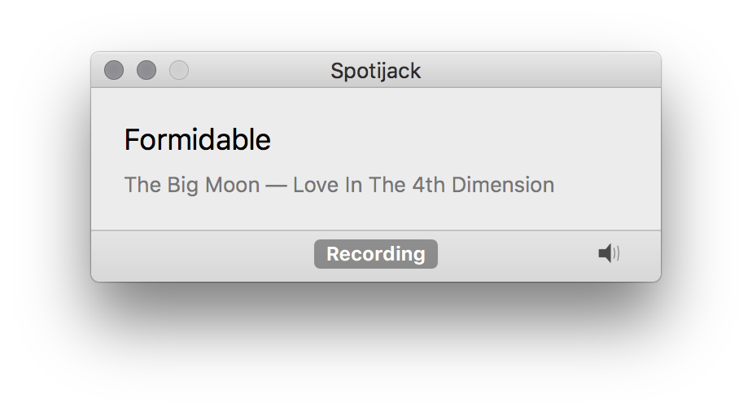

# Spotijack

> ⚠️ Spotijack will not work on macOS 10.15 (Catalina) because Audio Hijack Pro
> no longer runs. There is an experimental build [on this
> branch][recording-experiment-branch] that removes the need for Audio Hijack
> Pro.

[recording-experiment-branch]: https://github.com/alexjohnj/spotijack/tree/exp/recording

Spotijack is a macOS application that automates recording songs playing in
Spotify using [Audio Hijack Pro][audio-hijack-pro]. When Spotify changes track,
Spotijack starts a new recording in Audio Hijack Pro and updates the recording
metadata.

[audio-hijack-pro]: http://rogueamoeba.com/legacy/

## Piracy

This is a fun side-project I made which I've used to develop my skills
(AppleScript, some advanced Objective-C and Swift, unit testing). I've published
it to showcase my development skills. I'm assuming nobody's going to actually
use Spotijack because there are _far_ more efficient ways of getting music. I'm
not publishing binaries to discourage people from using Spotijack.

## Requirements

Spotijack requires macOS 10.14. You need a licensed copy of Audio Hijack Pro
(version 2, not 3) and any recent version of Spotify. You (probably) need a
premium Spotify account since Spotijack makes no attempt to distinguish between
adverts and songs.

Spotijack has only been tested using the instant-on plugin for Audio Hijack
Pro. You'll _also_ need a copy of Audio Hijack 3 to get the plugin.

## Usage

On first launch, Spotijack will handle creating a recording session in Audio
Hijack Pro as well as setting up Audio Hijack Pro and Spotify for scripting.
All you need to do is start playing a song in Spotify and hit the record button.

## Building

Spotijack uses Carthage to manage dependencies. Once they're set up, it should
build cleanly using Xcode 10. You should do a release build because the
optimisations provide a nice reduction in CPU usage.

## Implementation

Spotijack is the perfect example of an over engineered side project. Spotijack
is split into two parts, the GUI application _Spotijack_ and the library
_LibSpotijack_.

_LibSpotijack_ contains the core recording and application management logic. It
features a suite of unit tests (unit, not integration!) and, in theory, can be
used in other applications. _Spotijack_ is really just a GUI wrapper around
_LibSpotijack_.

_LibSpotijack_ doesn't do anything fancy to track recordings. It communicates
with Spotify and Audio Hijack Pro using the [ScriptingBridge
framework][scriptingbridge-framework-link] which is _so_ much fun to work with
in Swift (or Objective-C for that matter). _LibSpotijack_ just polls Spotify to
see if the current track has changed and if it has, it starts a new recording in
Audio Hijack Pro. Nothing fancy.

[scriptingbridge-framework-link]: https://developer.apple.com/library/mac/documentation/ScriptingAutomation/Reference/ScriptingBridgeFramework/

## Old Versions

Originally Spotijack was just a simple AppleScript I wrote one afternoon. Over
the years however, I've rewritten Spotijack as a native Cocoa application using
the [ScriptingBridge][scriptingbridge-framework-link] framework.

I have included the original AppleScript versions in the `Legacy` directory.
There's a changelog available in the `changelog.md` file. It's pretty sparse
since I didn't consider releasing this until 2015.

## License

Spotijack is licensed under the MIT license.
